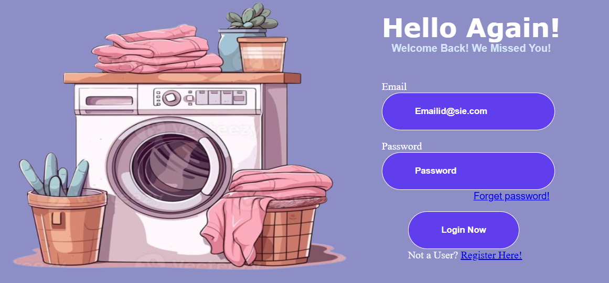

# 🔐 Responsive Login Page using Flexbox

This is a simple and clean login page built using **HTML** and **CSS Flexbox**. Designed for beginners who are just getting started with web development.

---

## 🚀 Features

- Fully responsive layout using Flexbox
- Clean and modern design
- Easy to customize
- Beginner-friendly structure

---

## 📸 Preview

 

---

## 📂 Project Structure

login-page/
│
├── index.html # Main HTML file
├── style.css # CSS styling with Flexbox
└── README.md # Project informa

📬 Contact

If you have any suggestions or want to connect, feel free to reach out on Telegram:

📲 Telegram - @CSGOWNER

